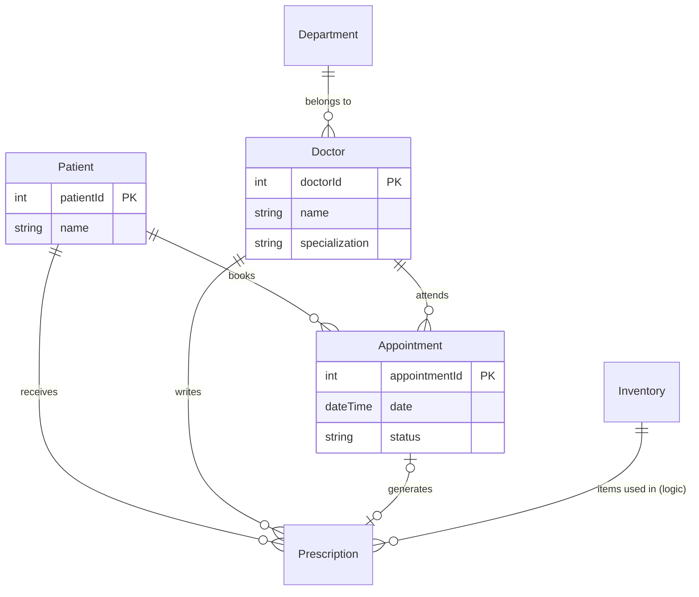
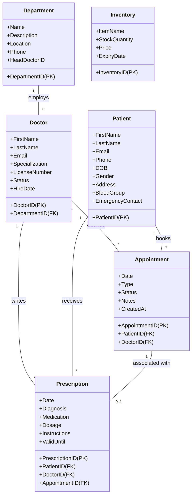
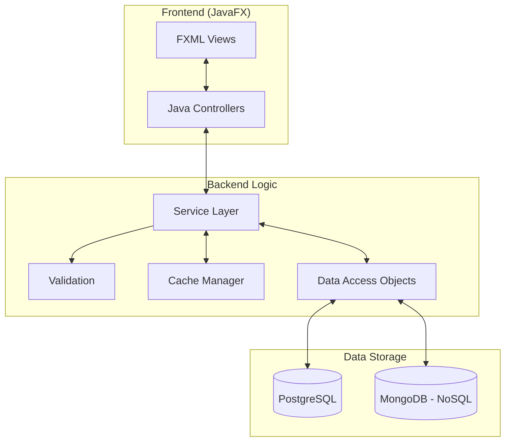
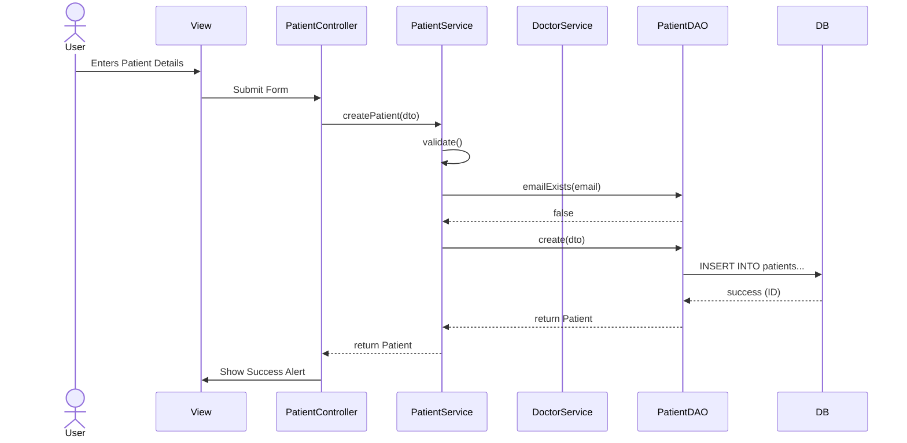

# Hospital Management System - Database Diagrams

## 1. Entity Relationship Diagram (ERD) - Overview

This diagram represents the high-level relationships between the core entities in the system.



---

## 2. Conceptual Data Model

The Conceptual Model identifies the highest-level relationships between the different entities. It focuses on **what** data is stored, not **how** (no attributes or keys yet).

```mermaid
graph TD
    subgraph "Hospital Resources"
        Dept[Department]
        Doc[Doctor]
        Inv[Inventory]
    end

    subgraph "Patient Care"
        Pat[Patient]
        Appt[Appointment]
        Presc[Prescription]
        Log[Medical Log (NoSQL)]
    end

    Dept -- employs --> Doc
    Doc -- treats --> Pat
    Pat -- schedules --> Appt
    Doc -- manages --> Appt
    Doc -- issues --> Presc
    Pat -- receives --> Presc
    Appt -- results in --> Presc
    Doc -- records --> Log
    Pat -- is subject of --> Log
```

---

## 3. Logical Data Model

The Logical Model adds details about attributes and relationships (Foreign Keys) without worrying about specific database implementation details (like VARCHAR vs TEXT).



---

## 4. Physical Data Model

The Physical Model represents the actual database schema implementation for **PostgreSQL**, including data types, primary keys, and foreign keys.

```mermaid
erDiagram
    departments {
        INT department_id PK
        VARCHAR(100) department_name
        TEXT description
        VARCHAR(100) location
        VARCHAR(20) phone_number
        INT head_doctor_id NULL
    }

    doctors {
        INT doctor_id PK
        VARCHAR(50) first_name
        VARCHAR(50) last_name
        VARCHAR(100) email
        VARCHAR(20) phone_number
        VARCHAR(100) specialization
        INT department_id FK
        VARCHAR(50) license_number
        DATE hire_date
        VARCHAR(20) status
    }

    patients {
        INT patient_id PK
        VARCHAR(50) first_name
        VARCHAR(50) last_name
        VARCHAR(100) email
        VARCHAR(20) phone_number
        DATE date_of_birth
        TEXT address
        VARCHAR(10) gender
        VARCHAR(5) blood_group
        VARCHAR(100) emergency_contact
        VARCHAR(20) emergency_phone
    }

    appointments {
        INT appointment_id PK
        INT patient_id FK
        INT doctor_id FK
        TIMESTAMP appointment_date
        VARCHAR(50) appointment_type
        VARCHAR(20) status
        TEXT notes
        TIMESTAMP created_at
    }

    prescriptions {
        INT prescription_id PK
        INT patient_id FK
        INT doctor_id FK
        INT appointment_id FK
        DATE prescription_date
        TEXT diagnosis
        TEXT instructions
        DATE valid_until
        VARCHAR(100) medication_name
        VARCHAR(50) dosage
        VARCHAR(50) frequency
        VARCHAR(50) duration
    }

    inventory {
        INT id PK
        VARCHAR(100) item_name
        INT stock_quantity
        DECIMAL(10,2) price
        DATE expiry_date
    }

    departments ||--o{ doctors : "FK: department_id"
    patients ||--o{ appointments : "FK: patient_id"
    doctors ||--o{ appointments : "FK: doctor_id"
    patients ||--o{ prescriptions : "FK: patient_id"
    doctors ||--o{ prescriptions : "FK: doctor_id"
    appointments |o--o| prescriptions : "FK: appointment_id"
```

### Physical Implementation Details

*   **Database**: PostgreSQL
*   **Normalization**: 3NF
*   **Keys**:
    *   `PK`: Primary Key (Auto-incrementing Integer)
    *   `FK`: Foreign Key (Indexed for performance)

---

## 5. System Architecture & Data Flow

### Component Diagram



### Data Flow (Patient Registration)


